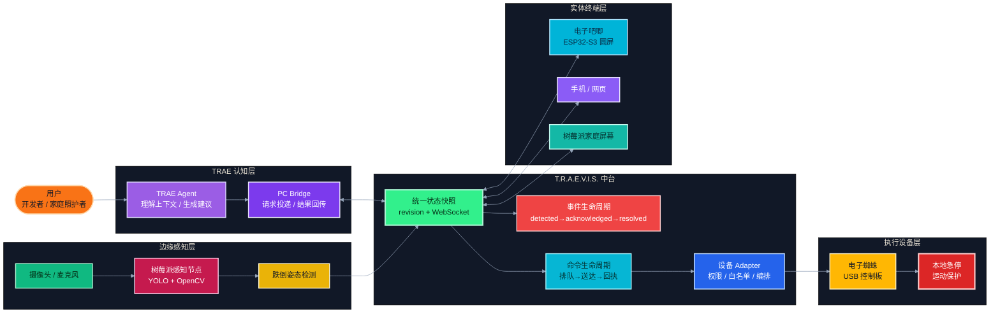
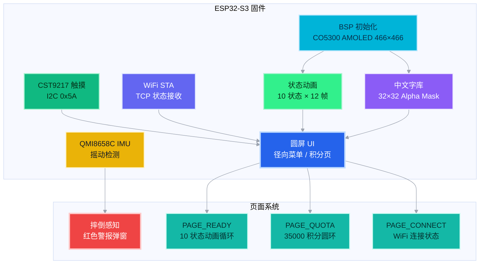
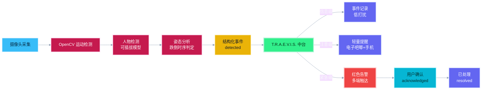
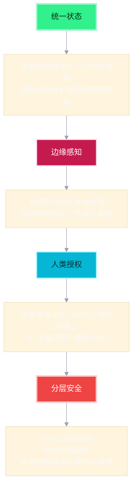

# T.R.A.E.V.I.S.：TRAE Agent 的多端协同具身 AI 系统

<p align="center">
  <b>ESP32-S3 × TRAE Agent × 统一中台 × 边缘感知 × 机器人执行</b><br>
  以 TRAE Agent 为认知核心，以统一状态中台为枢纽，以电子吧唧、家庭感知节点和机器人为现实接口的个人级多端协同智能系统。
</p>

<p align="center">
  
  
  
  
  
</p>

<p align="center">
  <b>赛道</b>：硬件交互 + 社会公益　|　<b>团队</b>：三个 Agenter　|　<b>阶段</b>：复赛
</p>

---

## 0. 项目一句话

**T.R.A.E.V.I.S.**（Think · Reason · Act · Exhibit · Visualize · Interact · Sync）是一套以 **TRAE Agent 为认知核心**、以 **统一状态与编排中台为系统枢纽**、以 **边缘感知节点、实体交互终端和执行设备为现实接口** 的个人级多端协同智能系统。它把项目运行态、家庭事件、设备状态和用户指令组织成同一条状态流：由 TRAE 理解上下文并生成建议或高层意图，由中台负责汇聚、分发、确认和追踪，再通过电子吧唧、树莓派屏幕、手机和机器人完成提醒、交互与受控执行，形成"感知 → 汇聚 → 理解 → 提醒 → 确认 → 执行 → 回传"的闭环。

这个项目的目标不是让用户随时随地加班，而是让 AI 承担等待、观察和重复执行，让开发不再受空间限制，让人回到生活。

> 当前仓库定位：**ESP32-S3 圆屏电子吧唧固件 + 统一状态中台 + 家庭边缘感知节点 + TRAE Bridge + 机器人受控执行闭环**。

---

## 1. 为什么做这个项目：应用场景与真实痛点

需要长期使用 AI Agent 的开发者，往往同时也是父母、子女或家庭照护者。工作中的代码生成、编译、测试和长任务需要持续等待，家庭现场又可能出现需要及时响应的变化，但人的注意力无法同时守在两个地方。

T.R.A.E.V.I.S. 想解决的核心矛盾是：**工作占用了人的持续注意力，家庭现场却无法被同时兼顾**。

这一矛盾背后有明确的现实数据支撑：

| 数据来源 | 关键数据 |
|---|---|
| 国家统计局 2025 年统计公报 | 2025 年末我国 60 周岁及以上人口达 32338 万人，占总人口 23.0% |
| 中国疾控中心相关科普 | 跌倒是我国老年人因伤害死亡的首位原因 |
| 国家疾控局 2026 年新闻发布会 | 超过 40% 的儿童非故意伤害发生在家中，年龄越小占比越高 |
| 国家消防救援局 2025 年数据 | 全国居住场所火灾 28 万起、死亡 1383 人；电气故障占 44%，生活用火不慎占 33.6%，厨房起火占 32.5% |
| 国家统计局 2025 年 12 月数据 | 全国企业就业人员周平均工作时间 48.6 小时 |

在真实场景中，开发者面临三类痛点：

1. **被绑在工位上**：用 TRAE 推进项目时，代码生成、编译、测试和模型训练经常需要等待。为了确认任务是否结束、是否报错、速通额度是否充足，必须不断切回 IDE。
2. **家庭无法兼顾**：离开电脑后，老人是否跌倒、孩子是否靠近危险区域、厨房是否有异常——这些信息无法及时获知，而人不可能同时守在电脑前和家庭现场。
3. **AI 被困在屏幕里**：今天的大多数 AI 能力仍然停留在浏览器、IDE 和命令行中。TRAE 能理解任务、调用工具并推进工作，但它没有通往现实世界的感知、交互与行动接口。

T.R.A.E.V.I.S. 用统一中枢连接项目状态、家庭事件和硬件状态，让系统负责持续观察，让人只处理真正重要的变化。

---

## 2. 项目亮点

| 亮点 | 说明 |
|---|---|
| TRAE Agent 认知核心 | TRAE 理解上下文并生成建议或高层意图，中台统一管理请求、任务状态和结果回传 |
| ESP32-S3 电子吧唧实体终端 | 240×240 圆形 AMOLED + 触摸 + IMU + WiFi，10 种工作状态动画 + 径向菜单交互 |
| 统一状态中台 | 项目、家庭事件、设备、机器人和命令进入同一快照，WebSocket 多端实时同步 |
| 家庭边缘感知 | 树莓派本地处理摄像头/麦克风，运动检测 + 人物检测 + 跌倒感知，原始数据不离开本地 |
| 机器人受控执行 | 电子蜘蛛巡逻 Demo，动作白名单 + 参数校验 + 二次确认 + 本地急停 |
| 分级提醒 | 信息 / 注意 / 紧急三级事件分级，按优先级触达多端，避免无意义打扰 |
| 摔倒感知警报 | IMU 摇动检测触发红色警报弹窗，脉冲计数 + 方向反转双重判断降低误触 |
| 积分系统 | 35000 积分总额度，圆环进度条直观显示使用情况 |
| 中文字库流水线 | PIL 渲染 32×32 Alpha Mask，分区烧录，支持 230+ 中文字符 |

---

## 3. 总体架构：从感知到执行的完整闭环



这张图表达了 T.R.A.E.V.I.S. 的核心逻辑：**TRAE 负责理解与规划，中台负责状态与编排，感知节点负责现实感知，电子吧唧负责实体交互，机器人负责受控执行**。它不是把所有功能堆在一个设备里，而是按认知、状态、感知、交互和执行分层组织，让每个模块职责清晰、可替换、可扩展。

---

## 4. 状态流转：感知 → 汇聚 → 理解 → 提醒 → 确认 → 执行 → 回传


无论是项目状态变化还是家庭事件，都沿着同一条链路流转：感知产生事实 → 中台汇聚与分级 → TRAE 理解与建议 → 多端提醒 → 用户确认 → 受控执行 → 结果回传，最终回到中台形成完整记录。

---

## 5. 面向谁：三类用户

### 5.1 核心用户：希望摆脱固定工位的 TRAE 重度用户

长期使用 TRAE、AI Agent 推进项目的开发者、算法工程师和独立创作者。他们经常需要等待代码生成、编译、测试、模型训练或长任务执行，却不希望为了查看一次进度始终守在电脑前。通过手表形态的电子吧唧和手机中台，用户可以在散步、通勤或陪伴家人时查看关键进度，并以"继续下一步""生成工作汇报""推荐后续开发"等轻量指令推动项目。

### 5.2 场景延伸用户：需要兼顾工作、生活与家庭的人

同一位开发者也可能是父母、子女或家庭照护者。当他离开工位、外出工作或无法陪在家人身边时，希望及时了解老人、孩子及家庭环境中真正值得关注的变化。T.R.A.E.V.I.S. 不追求全天候观看家庭画面，而是通过本地感知、事件触发和按需授权，辅助发现疑似跌倒、异常声音或家庭风险。

### 5.3 生态用户：希望让 AI Agent 连接真实设备的开发者

机器人开发者、创客和智能硬件团队。参考 MCP 的能力发现与工具调用思想，不同硬件可以把自身能力注册为 TRAE 可理解、可编排的具身工具。电子蜘蛛、陪伴型电子狗、智能行李箱、扫地机或家庭机器人都可以成为不同的硬件身体。

归根结底，T.R.A.E.V.I.S. 面向的是这样一群人：**他们希望 AI 承担等待、观察和重复执行，让开发不再受空间限制，让自己拥有更多完整的时间去生活和陪伴家人。**

---

## 6. 完整功能生长路径：八步演进

T.R.A.E.V.I.S. 的能力不是软件与硬件的简单拼接，而是沿着一条清晰路径逐步生长：先让 TRAE 的工作状态走出 IDE 被用户看见；再让用户通过实体终端与它交互；随后用统一中台连接项目、家庭与设备；进一步感知现实事件、完成多端提醒；最终在用户授权和安全边界内推动真实硬件采取行动。

### 第一步 · 看见 AI：让 TRAE 的工作状态走出 IDE

用户在电脑上把任务交给 TRAE 后，不必一直守在 IDE 前等待。T.R.A.E.V.I.S. 将项目活动、任务状态、完成结果、异常提醒和速通额度转化为统一状态，并同步到网站中台与手表形态的圆屏电子吧唧。

**用户路径**：向 TRAE 提交任务 → 离开电脑继续生活 → 随身查看关键进度 → 只在完成或异常时介入。

### 第二步 · 触摸 AI：从单向展示到双向协作

看到任务完成后，用户不需要立即回到电脑前，可以通过电子吧唧或手机选择"继续下一步""新开发推荐""工作汇报"等高层指令。请求经统一中台和 PC Bridge 投递给 TRAE，中台持续记录请求、排队、送达、失败与超时状态。

**用户路径**：收到完成提醒 → 选择或输入下一步任务 → Bridge 投递给 TRAE → 状态与结果返回中台 → 用户继续陪伴家人。

### 第三步 · 统一信息：从点对点连接到个人智能体中枢

当项目状态、家庭事件和硬件节点不断增加，用户需要的不是更多相互割裂的 App，而是一个统一、可信的状态入口。T.R.A.E.V.I.S. 中台将项目上下文、TRAE 任务、家庭事件、设备在线状态、机器人任务和用户操作组织成统一状态流。

**用户路径**：项目与设备持续上报状态 → 中台统一记录、排序和分发 → 用户从最方便的终端查看或操作 → 相关页面同步最新结果。

### 第四步 · 感知现实：从项目上下文走向家庭事件

家庭边缘节点负责辅助留意老人、孩子及家庭环境中的重要变化。摄像头、麦克风和后续传感器优先在本地完成运动、人物、声音和风险线索分析，再将经过判断的事实组织为结构化事件。复赛首先聚焦"疑似跌倒"场景，并通过视觉、姿态与时序证据逐步提高判断可靠性。

**用户路径**：家庭节点本地感知变化 → 形成结构化事件 → 本地先行提示 → 向中台上报必要信息。

### 第五步 · 协同提醒：从单点告警到多端确认闭环

T.R.A.E.V.I.S. 按照"信息、注意、紧急"对事件分级。普通状态只进入事件记录；需要关注的情况发送轻量提醒；疑似跌倒等紧急事件才主动触达树莓派家庭屏幕、电子吧唧、网站和手机。

**用户路径**：本地发现重要事件 → 中台按优先级分发 → 用户从电子吧唧或手机确认 → 所有终端同步最新处理状态。

### 第六步 · 授权行动：从 AI 建议到受控硬件执行

TRAE 可以结合上下文给出处置建议。只有在用户确认后，中台才会通过硬件适配层下发前进、后退、转向、巡逻、返回、停止或紧急停止等有限动作。底层控制器负责实时运动、超时保护和本地急停。

**用户路径**：查看事件与 TRAE 建议 → 确认让机器人协助查看 → 中台校验并记录任务 → 机器人执行 → 状态与结果回传 → 事件解决或升级。

### 第七步 · 按需巡查：从持续监控到授权移动感知

机器人搭载摄像头，成为只有在紧急事件触发或用户主动授权时才启动的移动感知节点。用户可以远程指定客厅、厨房或儿童房等区域，请机器人辅助查看。每次巡查都应限定目标区域、使用时长和可采集内容。

**用户路径**：紧急事件触发或用户主动发起查看 → 选择目标区域并确认授权 → 机器人前往指定位置 → 摄像头限时启用并返回必要信息 → 用户完成判断 → 摄像头关闭、机器人归位。

### 第八步 · 多形态具身：从一个大脑到多个硬件身体

电子吧唧不仅是随身状态终端，也可以成为 T.R.A.E.V.I.S. 的身份、交互与连接核心。蜘蛛机器人只是第一个具身载体：外出时可以接入陪伴型电子狗或智能行李箱；回到家中又可以接入扫地机、移动巡查机器人。硬件参考 MCP 的工具抽象与调用方式，将自身能力注册为受约束的具身工具。

**用户路径**：硬件接入并注册可用工具 → TRAE 根据任务选择合适的身体与能力 → 用户确认高风险动作 → Adapter 下发标准指令 → 本地控制器安全执行 → 状态与结果回传中台。

---

## 7. 三条完整用户路径

### 随身开发

```text
用户在电脑前向 TRAE 提交任务
→ 离开工位去散步、通勤或陪伴家人
→ 电子吧唧和手机中台同步关键进度
→ 用户通过轻量指令确认下一步
→ TRAE 在后台继续推进
→ 用户回到电脑后集中检查、验收和决策
```

### 远程家庭守护与按需巡查

```text
家庭节点在本地感知异常线索
→ 默认保持安静，只上报必要事件
→ 中台进行事件分级与状态追踪
→ 电子吧唧、手机按需提醒
→ 用户查看事件摘要并确认处理方式
→ 必要时授权机器人限时巡查指定区域
→ 机器人回传必要证据后结束任务
→ 摄像头关闭，设备返回待命状态
```

### 多形态硬件协作（后续演进）

```text
硬件向中台注册受约束的具身工具能力
→ TRAE 根据场景规划高层任务
→ 中台校验权限、前置条件和执行边界
→ 用户确认关键动作
→ 设备适配器转换为具体设备协议
→ 本地控制器负责运动闭环、安全保护和急停
→ 硬件身体执行并回传状态与结果
→ 中台形成可追踪的任务记录
```

---

## 8. 相比初赛 Demo 的升级

| 维度 | 初赛 Demo | 复赛升级 |
|---|---|---|
| 产品形态 | 以 ESP32-S3 圆形电子吧唧为核心的桌面实体终端 | 扩展为电子吧唧、网站中台、家庭边缘感知节点、手机入口和机器人身体协同的多端系统 |
| 系统架构 | TRAE、PC Bridge 与电子吧唧组成点对点链路 | 建立以 TRAE 为认知核心、中台为系统枢纽、感知与执行设备为现实接口的分层架构 |
| TRAE 协作 | 读取 TRAE 项目状态和额度，通过三个入口发送指令 | 由中台统一管理 TRAE 请求、任务状态、建议、结果与异常，形成可追踪的命令生命周期 |
| 项目能力 | 重点展示项目运行状态、编译结果和 Agent 进度 | 增加项目注册、目录浏览、文件读取、代码搜索和只读项目 Agent |
| 状态管理 | 主要同步 TRAE 状态、额度和用户操作 | 用统一快照管理 TRAE、家庭事件、设备、机器人和命令，通过 revision 与 WebSocket 保持多端状态一致 |
| 现实感知 | 家庭能力停留在设想 | 建立本地家庭感知原型，将运动、人物、声音等线索转化为结构化事件 |
| 提醒协同 | 以电子吧唧本地动画、声音和状态切换为主 | 建立信息、注意、紧急三级提醒与事件处理生命周期 |
| 具身执行 | 通过电子蜘蛛 Demo 证明 TRAE 的高层意图可以进入真实硬件 | 增加动作白名单、参数边界、二次确认、任务记录、状态回传和本地急停 |
| 隐私与安全 | 以本地网络、实体交互和摇动急停为主要安全手段 | 强调本地优先感知、事件触发而非持续监控、用户按需授权、执行权限与运动安全分层 |
| 扩展方式 | 围绕电子吧唧和单一电子蜘蛛进行功能扩展 | 参考 MCP 的能力发现与工具调用思想，让不同硬件注册为受约束的具身工具 |

**核心升级：从"看见并触摸 TRAE"，走向"统一管理 TRAE、感知现实、协同提醒，并在用户授权和安全边界内采取行动"。**

---

## 9. 电子吧唧固件架构



---

## 10. 家庭感知链路



家庭感知链路遵循"本地优先、最小上传"原则：原始画面默认留在树莓派本地，只有结构化事件信息同步到中台。

---

## 11. 安全与隐私设计



| 原则 | 具体措施 |
|---|---|
| 本地优先 | 原始音视频默认留在边缘节点，只同步事件摘要和必要证据 |
| 按需授权 | 摄像头默认关闭，任务开始后才按授权启用，任务结束即关闭 |
| 事件触发 | 正常保持安静，只有发现重要变化才主动提醒 |
| 分层安全 | TRAE 不直接控制电机，底层控制器始终负责运动闭环、碰撞保护与急停 |

---

## 12. 核心技术选型

### 12.1 硬件平台

| 模块 | 选型 | 在项目中的作用 |
|---|---|---|
| 电子吧唧主控 | ESP32-S3R8 (240MHz, 8MB PSRAM, 32MB Flash) | 圆屏 UI、触摸交互、IMU 摇动检测、WiFi TCP 通信 |
| 屏幕 | 1.75" 圆形 AMOLED 466×466, CO5300 驱动 (QSPI) | 显示状态动画、积分页面、摔倒感知警报 |
| 触摸 | CST9217 电容触摸 (I2C 0x5A) | 径向菜单导航、页面切换 |
| IMU | QMI8658C 六轴 (I2C 0x6B) | 摇动检测触发摔倒感知 |
| 音频 | ES8311 编解码 (I2C 0x18, I2S) | 启动提示音、状态切换音效 |
| PMU | AXP2101 (I2C 0x34) | 电源管理 |
| 家庭感知节点 | Raspberry Pi + 摄像头 | 本地运动检测、人物检测、跌倒感知 |
| 机器人执行 | 电子蜘蛛 + USB 控制板 | 受控巡逻、前进/后退/转向/停止 |

### 12.2 软件栈

| 模块 | 技术选型 | 在项目中的作用 |
|---|---|---|
| ESP-IDF | v5.5.2 (≥5.3.1) | ESP32-S3 底层驱动、FreeRTOS、分区管理 |
| LVGL | v9.5 | 圆屏 UI 渲染（traepal_player 版本） |
| 自研 UI 引擎 | C 手写帧缓冲 + Alpha 混合 | 圆屏直接绘制（quota_status 版本） |
| 中文字库 | PIL 渲染 32×32 Alpha Mask | 230+ 字符，分区烧录到 flash |
| 状态动画 | 10 状态 × 12 帧 RGB565 | 首帧基图 + Delta Patch 降低开销 |
| WiFi 通信 | STA 模式 + TCP | 接收 PC Bridge 推送的状态 JSON |
| 中台后端 | Node.js + TypeScript | 统一快照、REST API、WebSocket 多端同步 |
| 中台前端 | React 19 + Vite + TypeScript | 控制台、Agent 工作台、Markdown 渲染 |
| 家庭感知 | Python + FastAPI + OpenCV + YOLO | 运动检测、人物检测、事件结构化 |
| TRAE Bridge | TypeScript | 幂等队列、超时保护、串行窗口访问 |
| 测试 | Playwright + Pytest | 前端 E2E、后端单元测试 |

### 12.3 十种工作状态动画

| 状态 | 名称 | 含义 |
|---|---|---|
| 0 | idle_ready | 空闲待命 |
| 1 | thinking_scan | 思考扫描 |
| 2 | thinking_focus | 聚焦分析 |
| 3 | bug_alert | 异常告警 |
| 4 | fix_success | 修复成功 |
| 5 | sync_ping | 同步通信 |
| 6 | task_charge | 任务充电 |
| 7 | spider_bot | 蜘蛛机器人 |
| 8 | sleepy_nudge | 休眠提醒 |
| 9 | bug_maze | Bug 迷宫 |

---

## 13. 项目目录结构

```text
T.R.A.E.V.I.S/
├── src/
│   ├── hardware/                          # ESP32-S3 固件（版本化）
│   │   ├── v4_0707_wifi_quota_status/     # 当前主版本
│   │   │   ├── main/
│   │   │   │   ├── main.c                  # 固件主程序
│   │   │   │   ├── wifi_tcp.c/.h           # WiFi TCP 通信
│   │   │   │   └── CMakeLists.txt
│   │   │   ├── font_atlas.bin             # 中文字库（230字）
│   │   │   ├── gen_font_atlas.py          # 字库生成脚本
│   │   │   ├── partitions.csv             # Flash 分区表
│   │   │   └── sdkconfig.defaults         # ESP-IDF 配置
│   │   └── ...                             # 历史版本
│   ├── tarevis-control-center/             # 统一中台
│   │   ├── src/
│   │   │   ├── console/views/             # 控制台视图
│   │   │   │   ├── OverviewView.tsx       # 总览（设备状态）
│   │   │   │   ├── AgentView.tsx          # Agent 工作台
│   │   │   │   ├── SystemView.tsx         # 系统诊断
│   │   │   │   ├── EventsView.tsx         # 家庭事件
│   │   │   │   ├── DevicesView.tsx        # 设备管理
│   │   │   │   ├── RobotView.tsx          # 机器人控制
│   │   │   │   └── TraeView.tsx           # TRAE 状态
│   │   │   ├── control/                   # 适配器与工具
│   │   │   ├── pages/ConsolePage.tsx     # 控制台主页面
│   │   │   └── styles.css                 # 全局样式
│   │   ├── backend/                        # Node.js 后端
│   │   └── package.json
│   ├── home-perception-node/              # 家庭感知节点
│   │   ├── pose_server.py                 # 姿态服务
│   │   ├── ui/                            # 480×320 触摸界面
│   │   └── requirements.txt
│   ├── trae-communicate/                  # TRAE Bridge
│   └── trae-status-monitor/              # TRAE 状态监控
├── yolo_pose/                             # YOLO 姿态检测模型
├── TAREVIS_TRAE_JARVIS_AI工作搭子项目总纲.md
└── TraePal_AI工作搭子电子吧唧_精简版.md
```

---

## 14. 开发难点与解决方案

### 14.1 固件层难点

| 遇到的问题 | 我和 TRAE 共同找到的解决方案 |
|---|---|
| AMOLED 大面积刷新导致 SPI 队列异常 | 改为四行分块刷新，控制单次传输规模 |
| QMI8658 加速度数据始终为零 | 对照官方实现定位并补齐 CTRL7 使能配置 |
| 摇动与普通滑动难以区分 | 使用脉冲计数与方向反转次数双重判断 |
| 动画资源占用过大 | 使用首帧全屏基图与后续 Delta Patch 补丁 |
| PC 连接电子吧唧后网络受影响 | 将硬件通信从 AP 模式调整为 STA 模式 |
| 中文字库难以直接放入固件 | 建立 PIL 渲染、Alpha Mask、二进制生成与分区烧录流水线 |

### 14.2 一次关键调试：把人的物理直觉翻译成算法

开发中最能体现人机协作的一次调试，是解决摇动检测误触发问题。最初的算法只判断加速度幅值，上滑和左滑也会被错误识别为摇动。我向 TRAE 描述了自己的物理直觉："滑动通常保持单一方向，而摇动会在短时间内反复改变方向。"

TRAE 将这个直觉转化为"加速度脉冲计数 + 方向反转次数"的双重判断条件。经过多轮阈值调整，摇动与普通滑动终于能够被稳定区分。这次经历让我意识到，TRAE 的价值不只是生成代码，还在于把人的经验和直觉快速转化为可以验证、迭代的工程方案。

### 14.3 中台工程化难点

TRAE Bridge 最能体现工程化协作。团队要求浏览器不能直接操作本机 TRAE，同一 requestId 不能重复投递，共享窗口必须串行访问，超时且结果未知时不能自动重试，"提示词已发送"也不能被写成"开发任务已完成"。TRAE 据此协助实现 LiveTraeAdapter、readiness、幂等队列、超时与稳定错误语义，并通过 Mock Strategy、Fake Bridge 和浏览器端到端测试验证软件链路。

---

## 15. TRAE 实践过程

### 15.1 我们如何与 TRAE 协作

T.R.A.E.V.I.S. 横跨 ESP32 固件、Python 感知服务、TypeScript 中台和网页交互。团队负责定义真实问题、产品边界和验收标准，TRAE 负责阅读仓库与硬件资料，协助完成方案拆解、跨栈实现和自动验证；实机现象、交互体验、隐私原则与安全决策仍由人判断，并成为下一轮修改的输入。

```text
团队提出场景、约束与验收标准
→ TRAE 阅读项目上下文并拆解任务
→ 共同冻结接口、状态与异常语义
→ TRAE 协助实现并运行自动化检查
→ 成员完成实机或真实场景验证
→ 带着真实反馈继续迭代并记录边界
```

### 15.2 三个实践案例

| 实践案例 | 负责人 | 关键产物 | 当前验证 | 明确边界 |
|---|---|---|---|---|
| 圆屏实体前端 | 我 | ESP32 固件、字体与动画资源脚本、触摸 UI、WiFi TCP 原型 | 编译与烧录截图、圆屏实机、初赛 GIF / 视频 | 完整 UI 与联网能力来自不同演进原型，最终合并固件待整理 |
| 统一状态中台与 TRAE Bridge | @ratmal | 统一快照、REST / WebSocket、LiveTraeAdapter、本地 Bridge | 类型检查、单元与集成测试、Fake Bridge、双浏览器 Playwright | 真实 TRAE 窗口 Phase 6 尚待现场验收 |
| 家庭感知节点 | @Doorocean | 事件契约、视觉与音频管线、FastAPI、WebSocket、触摸 UI | 合成视频与 Mock 测试、Windows 摄像头、本地页面联调 | 真实麦克风、树莓派、跌倒时序和主中台接入待验收 |
| 机器人安全模型 | @ratmal | 动作白名单、参数校验、二次确认、命令状态和急停接口 | 软件契约、Mock Adapter 与自动化测试 | 真实 RobotAdapter、USB 协议、硬件回执和实机急停待接入 |

---

## 16. 产品创作历程

**起点**：我同时使用 TRAE 推进多个 AI4S 项目，代码生成、编译、测试和模型任务经常需要等待。为了确认任务是否结束、是否报错、速通额度是否充足，我必须不断切回 IDE。于是第一个想法出现了：能不能让 TRAE 的工作状态走出 IDE，进入一个始终在身边、抬手就能看到的实体终端？

**第一次实体化**：我选择了带圆形 AMOLED 屏幕、触摸、IMU 和无线通信能力的 ESP32-S3 开发板，把它做成手表形态的电子吧唧。一个有趣的循环由此形成：我使用 TRAE 编写电子吧唧的固件，而电子吧唧最终又成为 TRAE 的实体前端。

**初赛验证**：完成了圆屏 UI、动画与字库系统、触摸和 IMU 交互、WiFi TCP 链路，以及 PC 端 Bridge 四件套。接入电子蜘蛛，将高层意图转换为前进、后退、转向、巡逻和停止等动作，验证了最小具身闭环。

**复赛转折**：真正需要升级的不是设备数量，而是系统中枢。当项目、家庭感知、电子吧唧、手机和机器人同时接入时，真正困难的不再是多加一块屏幕或一个摄像头，而是谁负责保存状态、判断优先级、管理权限，以及在异常发生后追踪处理结果。因此建立了 T.R.A.E.V.I.S. 统一中台。

**从一个身体到多个身体**：硬件不应该被写死在系统里，而应该像 Agent 的工具一样描述并注册自己的能力。参考 MCP 的能力发现与工具调用思想，TRAE 负责理解任务和生成高层计划，中台负责权限、编排和记录，设备适配器负责协议转换，本地控制器负责可靠执行。

> 我用 TRAE 创造 T.R.A.E.V.I.S.，再用 T.R.A.E.V.I.S. 为 TRAE 建立通往现实世界的接口。

---

## 17. DEMO 演示

### 第一幕：统一状态中台

网站和树莓派屏幕显示家庭状态正常。展示树莓派、摄像头、电子吧唧、TRAE 和蜘蛛机器人均在线。在一个终端切换状态，其他终端实时同步。

### 第二幕：与 TRAE 沟通

用户通过网站或电子吧唧发出指令。PC Bridge 将指令发送给 TRAE。网站显示 TRAE 从空闲进入思考和工作状态。TRAE 回复摘要同步到树莓派屏幕和电子吧唧。

### 第三幕：具身执行

用户让 TRAE 控制蜘蛛机器人巡逻。PC Bridge 向电子吧唧发送白名单动作。电子吧唧通过 USB 控制机器人控制板。蜘蛛完成前进、转向和停止，状态同步回网站。

### 第四幕：家庭守护

模拟或真实触发老人疑似跌倒。树莓派 YOLO 生成高优先级事件。树莓派屏幕立即红色告警。网站事件流和当前主状态同步更新。电子吧唧收到红色告警。手机网站和手机通知收到同一事件。TRAE 给出处置建议。用户确认事件，所有终端同步显示"已处理"。

---

## 18. 团队介绍

我们是 **三个 Agenter**，三名来自不同工程领域、因为同一个想法聚在一起的工程师：如果 TRAE 是一个能够理解任务、调用工具并持续推进工作的智能大脑，那么它能不能拥有自己的身体、自己的中枢，以及进入真实生活的接口？

| 成员 | 核心方向 | 在 T.R.A.E.V.I.S. 中的作用 |
|---|---|---|
| **我**（幽默彭博士） | AI4S、具身执行与嵌入式系统 | 将高层意图落成可交互、可执行、可追踪且能够安全停止的硬件动作 |
| **@ratmal** | 智能架构、TRAE 通信与状态协同 | 将 Agent 意图、系统状态和多设备能力组织成统一的智能中枢 |
| **@Doorocean** | 自动驾驶感知融合、边缘智能与交互系统 | 让系统在本地理解现实环境，并将感知结果转化为可理解、可操作的家庭决策入口 |

三个人共同构成了 T.R.A.E.V.I.S. 的认知、执行、感知与交互链路，而 TRAE 贯穿需求拆解、代码实现、测试和迭代，成为连接三种工程能力的智能协作者。

---

## 19. 商业化与落地路径

| 阶段 | 首批用户或合作方 | 产品形态 | 落地理由 |
|---|---|---|---|
| 开发者状态终端 | 长期使用 TRAE 的开发者、算法工程师和独立创作者 | 电子吧唧 + PC Bridge + 个人中台 | 与现有完成度最接近，验证用户是否愿意为"离开工位仍有回执"持续使用产品 |
| 家庭风险辅助感知试点 | 有异地照护需求的家庭、社区养老服务机构、智能家居集成方 | 本地感知节点 + 家庭中台 + 多端提醒 | 先围绕"疑似跌倒"单场景试点，验证误报率、提醒时延、确认流程和隐私接受度 |
| 设备接入生态 | 机器人团队、创客和硬件厂商 | Adapter SDK、白名单工具协议与集成服务 | 复用统一状态、权限和审计能力，让不同传感器与硬件身体接入同一个 TRAE 中枢 |

《中共中央、国务院关于深化养老服务改革发展的意见》提出优化"居家为基础、社区为依托、机构为专业支撑"的养老服务供给格局。T.R.A.E.V.I.S. 更适合从家庭风险辅助感知和社区服务转介切入，而不是直接承担医疗诊断或紧急救援职责。

---

## 20. 分阶段迭代计划

| 阶段 | 重点工作 | 验收标准 |
|---|---|---|
| 当前已验证 | 圆屏实体前端、统一状态中台、家庭感知 PC 原型、TRAE 与机器人软件契约 | 保留编译、自动化测试、Windows 摄像头、Mock / Fake 与实机素材等现有证据，并准确标注验证层级 |
| 复赛重点闭环 | 真实 TRAE 窗口验收、树莓派部署、疑似跌倒姿态与时序、主中台接入、真实 RobotAdapter 与 USB 回执 | 优先完成一个真实、稳定、可确认的"疑似跌倒"闭环，以及一条具备白名单和急停的最小硬件动作链路 |
| 下一阶段扩展 | 厨房专用传感器、儿童危险区域、手机通知、事件证据与家庭联系人规则 | 每增加一个场景，都分别验证传感器事实、误报、断网降级、用户确认和隐私策略 |
| 长期生态 | 多设备 Adapter、社区服务接口、按需机器人巡查 | 先完成权限、审计、失败恢复和责任边界，再扩展自动化程度与硬件种类 |

**迭代原则**：不以功能数量证明价值。先把单场景做成真实、稳定、可确认、可降级的闭环，再复用同一套事件与 Adapter 架构扩展到更多家庭问题。

---

## 21. 硬件展示

### 圆屏电子吧唧：随身状态与交互终端

电子吧唧基于 ESP32-S3 圆屏设备，支持状态展示、触摸菜单、动画反馈和局域网通信。它的定位是低打扰的随身入口，不承担在小屏幕上编写复杂代码的任务。

### 树莓派家庭节点：本地感知与家庭状态入口

树莓派节点连接摄像头和触摸屏，运行家庭状态驾驶舱与本地服务原型，负责把现实环境中的线索转换为结构化事件。当前已完成 PC 端软件原型、Windows 摄像头和本地页面验证；树莓派实机部署及主中台接入仍按复赛计划验收。

### 电子蜘蛛：受控执行载体

电子蜘蛛用于验证 TRAE 的高层意图如何经过中台、Adapter 和本地控制器进入真实硬件动作。运动闭环、参数边界、通信超时和物理急停属于执行层安全约束。

---

## 22. 快速开始

### 22.1 克隆仓库

```bash
git clone https://github.com/ibh4/T.R.A.E.V.I.S.git
cd T.R.A.E.V.I.S
```

### 22.2 电子吧唧固件

```bash
source /path/to/esp-idf/export.sh
cd src/hardware/v4_0707_wifi_quota_status
idf.py set-target esp32s3
idf.py build
idf.py -p /dev/tty.usbmodemXXXX flash
```

### 22.3 统一中台

```bash
cd src/tarevis-control-center
npm install
npm run dev          # 前端 http://127.0.0.1:5180
cd backend && npm run dev   # 后端
```

### 22.4 家庭感知节点

```bash
cd src/home-perception-node
pip install -r requirements.txt
python pose_server.py       # http://localhost:8000
```

---

## 23. 当前限制与后续优化

1. **真实 TRAE 窗口验收**：Live Adapter 已实现，真实 TRAE 窗口的 Phase 6 现场验收待完成
2. **树莓派实机部署**：家庭感知 PC 原型已完成，树莓派实机、真实麦克风和跌倒时序判定待验收
3. **手机 Push 推送**：网页端已支持，原生手机通知待接入
4. **真实 RobotAdapter**：软件契约和 Mock 已通过，真实 USB 协议和硬件回执待接入
5. **多形态硬件扩展**：电子狗、智能行李箱、扫地机等通过 Adapter 逐步接入
6. **专用传感器**：燃气、烟感、一氧化碳等专用传感器替代纯视觉判断
7. **社区服务接口**：对接社区养老服务转介，而非直接承担医疗诊断

---

## 24. 参考资料

- [ESP32-S3-Touch-AMOLED-1.75C 开发板文档](https://www.waveshare.com/wiki/ESP32-S3-Touch-AMOLED-1.75C)
- [ESP-IDF 编程指南](https://docs.espressif.com/projects/esp-idf/zh_CN/latest/esp32s3/)
- [QMI8658C 惯性传感器数据手册](https://datasheet.lcsc.com/lcsc/2205111630_qst-QMI8658C_C5077303.pdf)
- [Ultralytics YOLO 文档](https://docs.ultralytics.com/)
- [FastAPI 官方文档](https://fastapi.tiangolo.com/)
- [React 19 文档](https://react.dev/)
- [国家统计局 2025 年统计公报](https://www.stats.gov.cn/sj/zxfbhjd/202602/t20260228_1962662.html)
- [国家疾控局 2026 年新闻发布会](https://www.ndcpa.gov.cn/jbkzzx/c100009/common/content/content_2077579009237356544.html)
- [《中共中央、国务院关于深化养老服务改革发展的意见》](http://www.news.cn/politics/20250107/d30f78e7e3e14d6e8b7e3c8e8b7e3c8e.htm)

---

## 25. License

MIT License. See `LICENSE` for details.

---

> **T.R.A.E.V.I.S. 是一个把 TRAE 变成现实世界 JARVIS 的实体 AI 工作搭子。** 它用电子吧唧承载动画、声音和交互，用统一中台管理项目与家庭状态，用家庭感知节点理解现实环境，用机器人完成受控执行，最终成为一个既陪我写代码，也帮我留意现实生活的个人 AI 助手系统。
